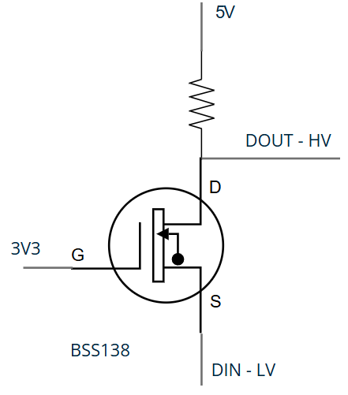

# Multimedija - cajgeri

Cilj: Zamena fabričkih *LED*-ova za osvetljenje pozadine dawshboard-a sa **ws2812b** kako bi se omogućila kontrola boje pozadinskog osvetljenja

---

## Hardverska platforma

- Za prototipsku montažu korišćena je perforirana prototipska ploča (*perfboard*) sa rasterom rupa od 2.54 mm.

## Faze

### v1.0

> Cilj: Promena osvetljenja sa predefinisanim statičkim bojama/animacijama

- :x: Napajanje dioda sa napajanja starih dioda  
  - Diode na kontrolnoj tabli imaju zajednički plus, dok **WS2812B** zahteva da razlika napona između GND-a i *data* linije bude najmanje 70% od VCC-a.  
  - Zbog razlike u logici napajanja, direktna upotreba postojećeg sistema nije moguća.

- :white_check_mark: Napajanje dioda putem **Arduino UNO** koji se napaja iz punjača za telefon  
  - Sistem funkcioniše, ali **Arduino UNO** nije mehanički stabilan za primenu u vozilu – dolazi do prekida na *data* liniji tokom vibracija, što dovodi do nestabilnosti u prikazu boja.  
  - Napon nije optimalno stabilan.  
  - Dodatno, USB kabl se prostire kroz ceo automobil i zauzima jedno mesto na punjaču.

- :white_check_mark: Napajanje pomoću *buck* konvertora i korišćenje **ESP-8266** čipa sa devboard-om  
  - **ESP8266** omogućava brže i glađe animacije zahvaljujući višoj procesorskoj snazi.  
  - Radi na 3.3V, dok **WS2812B** *LED* trake zahtevaju 5V logički nivo na *data* liniji, što zahteva *level shifting*.  
  - Planirano korišćenje *MOSFET-a* kao level shiftera za podizanje *data* signala sa 3.3V na 5V.  
  
  - :x: Lemljenje mikroprocesora direktno na *perfboard* ploču
  - :x: Problem sa trenutnim **BSS138** – dostupan je samo u SMD pakovanju, što nije pogodno za *perfboard* ploču.
  - :white_check_mark: Napajanje ESP-a iz buck konvertora uspešno testirano i stabilno funkcioniše.
  - :x: Problem sa **2N7000** - loše radi na 3V3 logici
  - :white_check_mark: Povratak **BSS138**, ali sa *Soc-23/Dip-3* adapterom
  - :white_check_mark: Promena stanja digitalnog izlaza na 2s, na outputu se čita 0V ili 5V
  - :question: Povezivanje sa diodom, dioda svetli ali u nasumičnim bojama
    - :exclamation: **Adfruit NEOPIXEL** ne radi sa *ESP*-om; Migracija na **FastLED**
---

## TODO

- [ ] Konektor za 12V napon u autu
- [ ] *API* za promenu boja
- [ ] Migracija na **FastLED** biblioteku
- [ ] TODO: Ubaciti šeme

## Rezultati i realizacije

- [x] Zamena fabričkih dioda sa **ws2812b**
- [x] Implementacija **Arduino UNO** u auto  
- [x] Implementacija stabilnog napajanja sa *buck* konvertorom (12V - 5V)
- [x] Migracija sa **Arduino UNO** na **ESP-8266** radi poboljšanih performansi i bolje otpornosti na vibracije
- [x] Izrada stabilnog konektora za napajanje i signalne linije
- [x] Level shifter
- [x] 2A osigurač na ulazu 